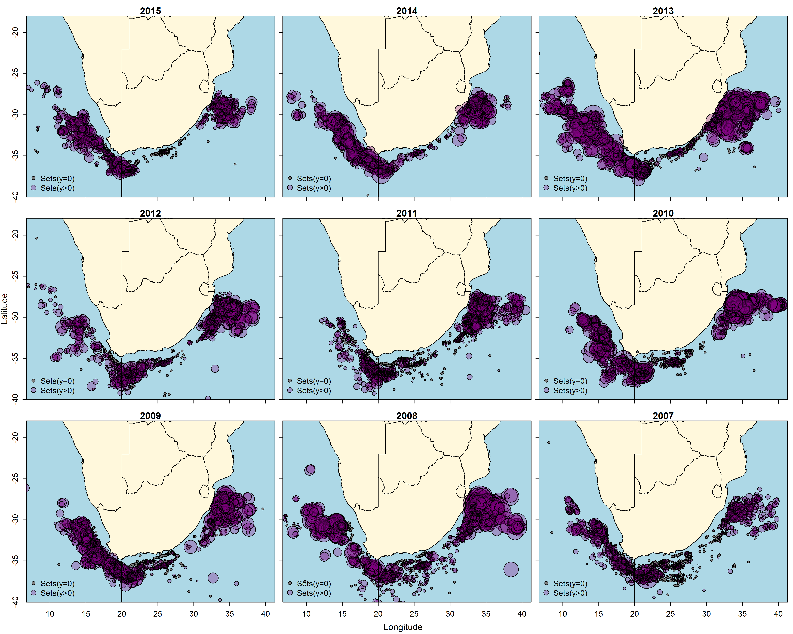
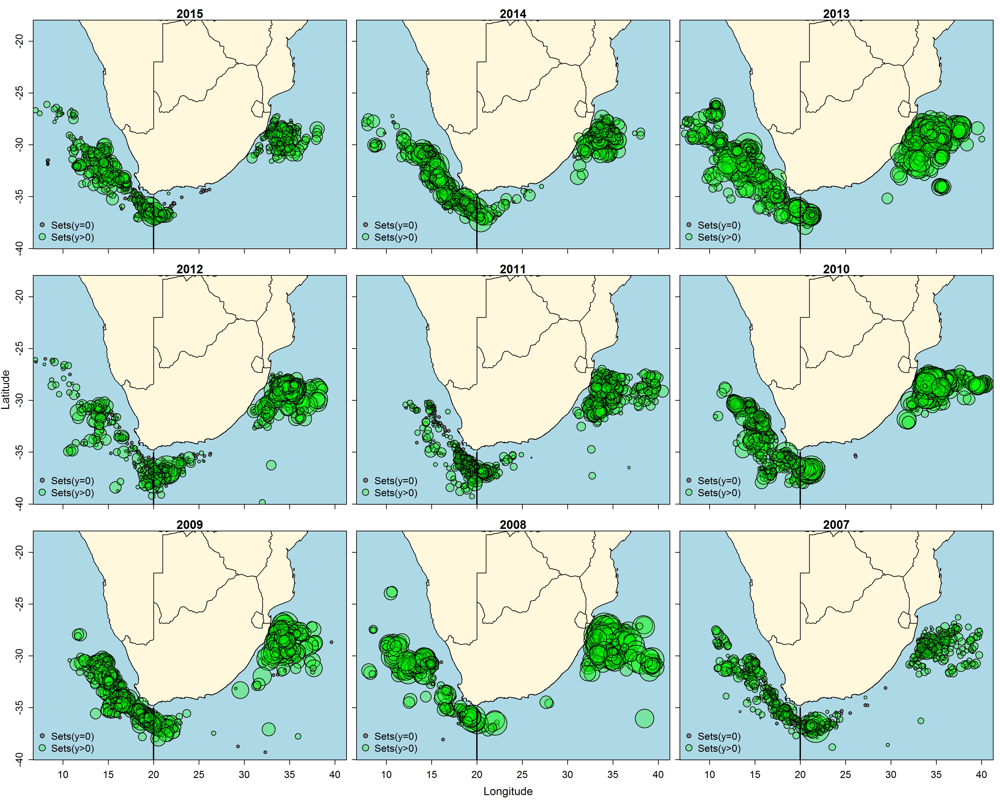
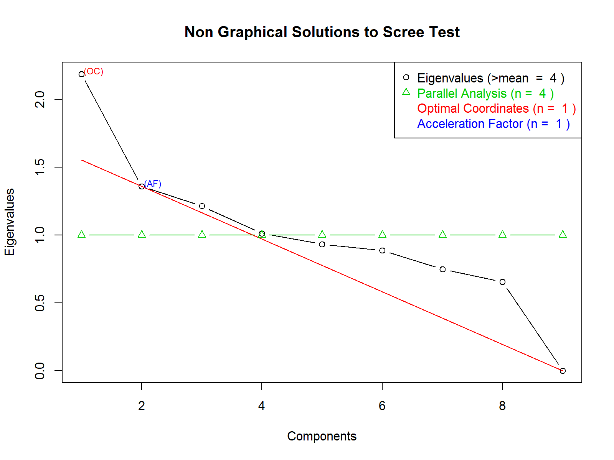
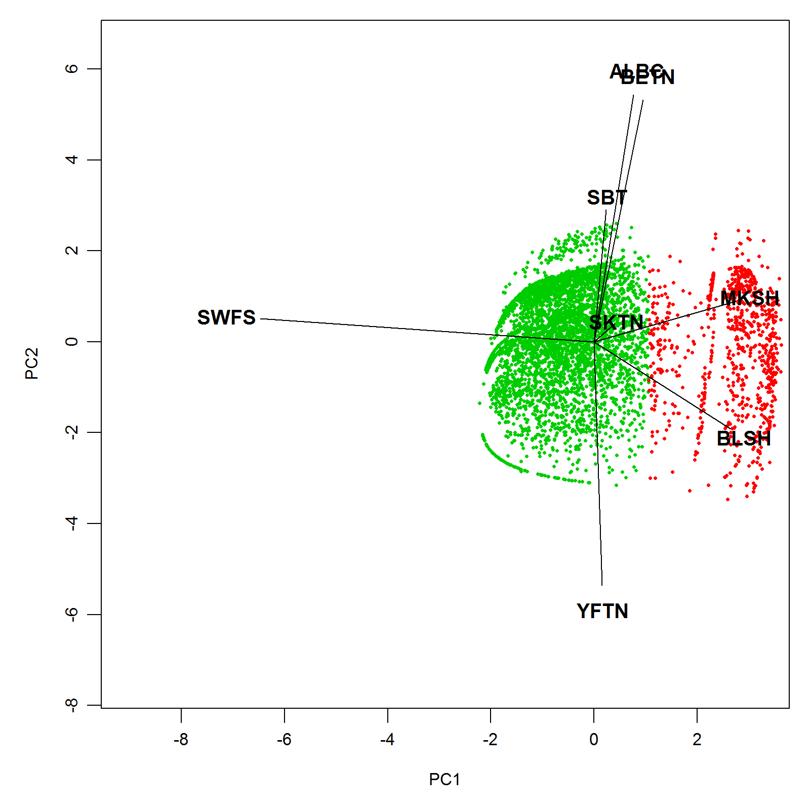
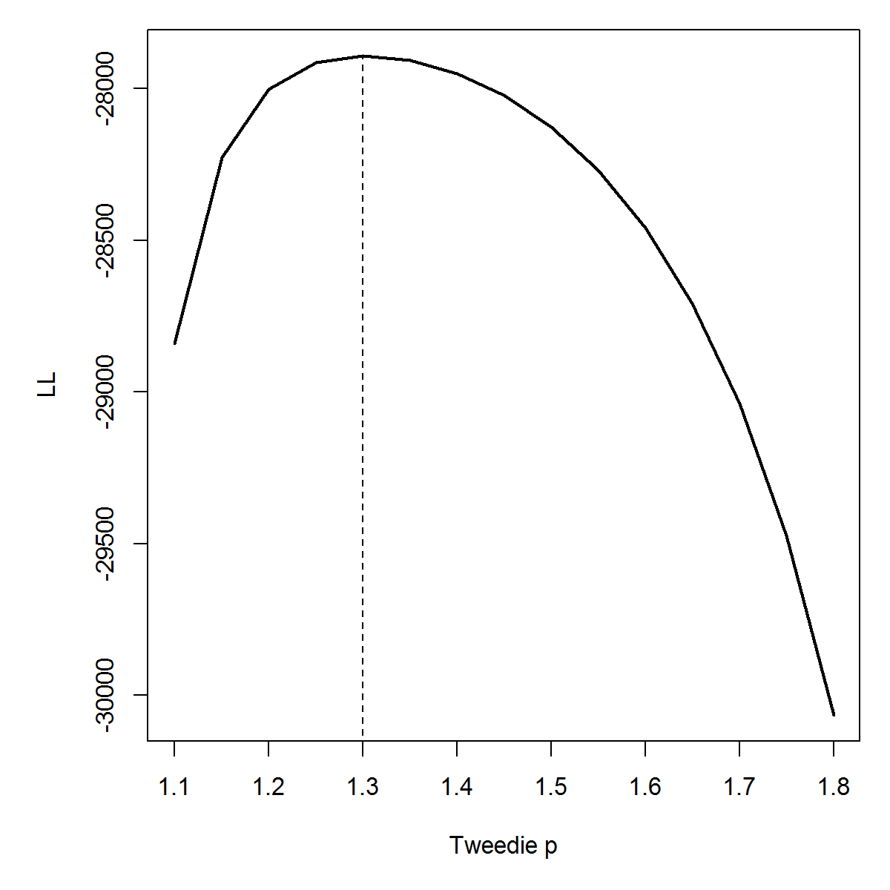
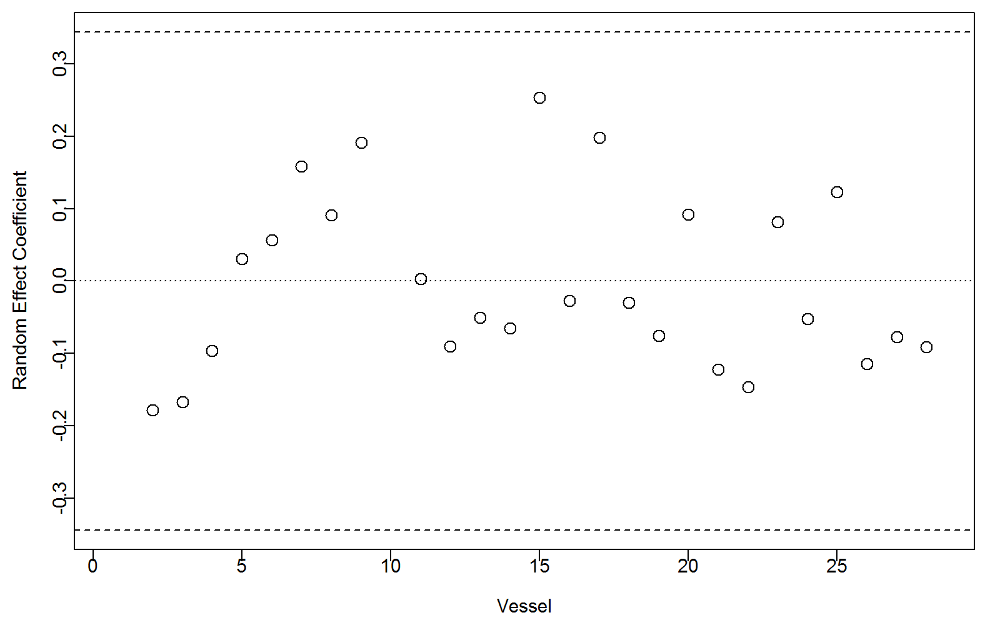
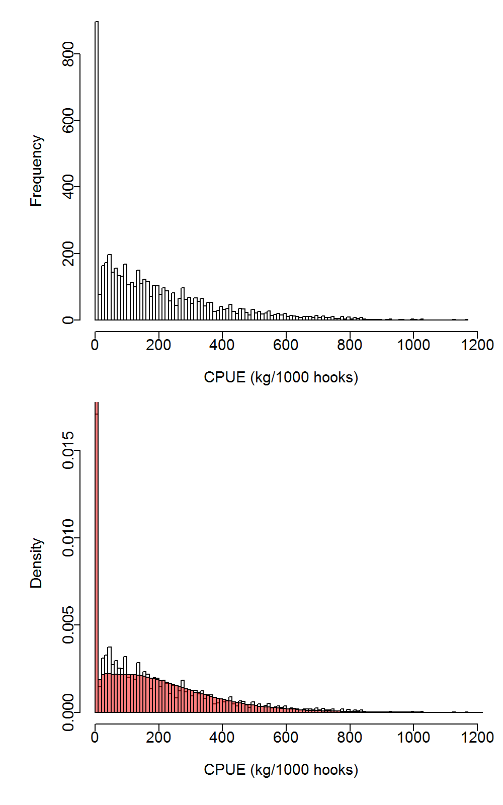
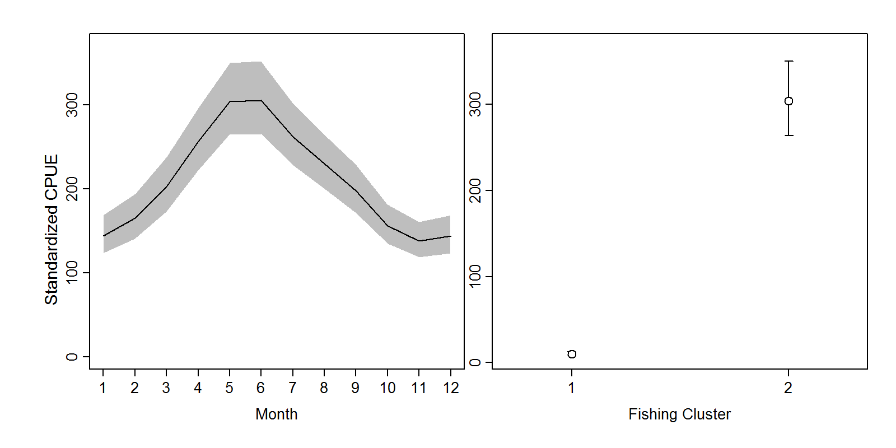
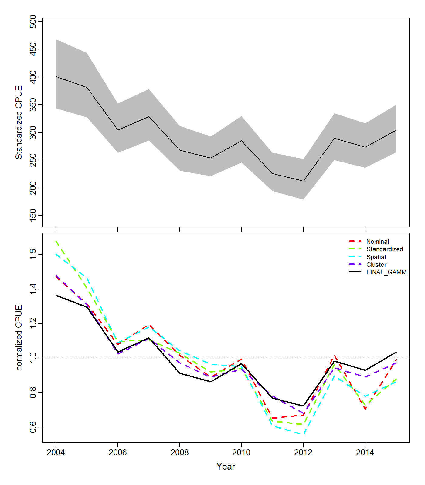

##### Summary

Swordfish, *Xiphias gladius* is a target species in the South African pelagic longline fleet operating along the west and east coast of South Africa. A standardization of the CPUE of the South African swordfish directed longline fleet for the time series 2004-2015 was carried out with a Generalized Additive Mixed Model (GAMM) with a Tweedie distributed error. Explanatory variables of the final model included *Year*, *Month*, geographic position (*Lat, Long*) and a *Targeting* factor with two levels, derived by clustering of PCA scores of the root-root transformed, normalized catch composition. Vessel was included as a random effect. Swordfish CPUE had a definitive seasonal trend, with catch rates higher in winter and lower in summer. The standardised CPUE analysis indicates a consistently declining trend over the period 2004-2012, followed by a notable increase in CPUE between 2012 and the final assessment year (2015). 

##### Keywords
*Swordfish, standardized cpue, longline, GAMM, targeting, PCA cluster, random effect*

##### Affiliations
Department of Agriculture, Forestry and Fisheries (DAFF), South Africa

[](c:/Users/USER/Desktop/Temp/Markdown/Rmarkdown1/DAFF_Logo.png)

```{r chnk1a,echo=F,message=FALSE,tidy=TRUE,warning=FALSE,results='hide'}
############################ Load the libraries ###########################
libLst=c('ggplot2','reshape','readr','dplyr','coda','runjags','rjags','captioner','magrittr','tidyr','broom','xtable','dclone','plyr')
invisible(suppressPackageStartupMessages(lapply(libLst,library,character.only=T)))


#tabCaps=captioner(prefix='Table')
#figCaps=captioner(prefix='Figure')

#### Table captions
#tabCaps(name='tab6',caption='Model table showing only for the smoothed part: Angola')

##Figure captions
#figCaps(name='Fig1',caption="Posterior probability density of $r$, $q$ [q_o], $K$, $\\sigma_{o}$ [sigmaO], $\\sigma_{p}$ [sigmaP], and $P_{in}$ [Pin] for the first variant of Shaefer model: same $q$ and $\\sigma_{o}$ for the west and south coast")
```

#Introduction
Commercial fishing for large pelagic species in South Africa dates back to the 1960s [@Welsh1968;@Nepgen1970]. Exploitation of large pelagic species in South Africa can be divided into four sectors, 1) pelagic longline, 2) tuna pole-line 3) commercial linefishing (rod and reel) and 4) recreational linefishing. Pelagic longline vessels are the only vessels that target swordfish, with negligible bycatch being caught in other fisheries. Pelagic longline fishing by South African vessels began in the 1960s with the main target being southern bluefin tuna (*Thunnus maccoyii*) and albacore (*Thunnus alalunga*) [@Welsh1968;@Nepgen1970]. This South African fishery ceased to exist after the mid 1960's, as a result of a poor market for low quality southern bluefin and albacore (Welsh, 1968). However, foreign vessels, mainly from Japan and Chinese-Taipei, continued to fish in South African waters from the 1970s until 2002 under a series of bilateral agreements. Interest in pelagic longline fishing re-emerged in 1995 when a joint venture with a Japanese vessel confirmed that tuna and swordfish could be profitably exploited within South Africa's waters. Thirty experimental longline permits were subsequently issued in 1997 to target tuna, though substantial catches of swordfish were made during that period [@Penney1999d]. 

The commercial fishery was formalised in 2005 with the issuing of 10-year long term rights to swordfish- and tuna-directed vessels. On average, 15 South African vessels are active in a year and target swordfish in 20-30m length vessels. Additionally, foreign flagged vessels catch swordfish as bycatch. South Africa's swordfish catches reached a peak in 2002 at 1 187 t, and have been on the decline with average catches of 372 t for the period 2009-2014. The fishery is coastal and swordfish-oriented effort concentrates in the southwest Indian Ocean region (20?-30?S, 30?-40?E) and along the South African continental shelf in the southeast Atlantic (30?-35?S, 15?-18?E). As such, the fishery straddles two ocean basins, the Indian and Atlantic Ocean. The jurisdictions of the Indian Ocean Tuna Commission (IOTC) and International Commission for the Conservation of Atlantic Tuna (ICCAT) are separated by a management boundary at 20?E. Consequently, all tunas and billfish stocks with the exception of the southern bluefin tuna (*Thunnus maccoyii*), are artificially divided into Atlantic and Indian Ocean stocks along this boundary, regardless of their true stock structure and distribution. Since questions remain about the origin of South African caught swordfish, it remains uncertain if the artificial split in reporting stock indices indeed reflects a biological meaningful separation of stocks.

In 2013 South Africa presented a standardized catch rate of swordfish (in number) caught by the South Africa longline fleet in the South Atlantic Ocean between 1998 and 2012 (SCRS/2013/159).The Group acknowledged the effort made and recommended further improvement regarding the model formulation and the predictions for extracting the year effect on the standardized index. The Group decided not to include this series in the 2012 stock assessment modelling process.

Here we present improved standardised catch-per-unit-effort (CPUE) indices that were obtained with a generalised additive mixed model (GAMM) of swordfish catch and effort data from the South African pelagic longline fleet operating in the South Atlantic Ocean between 2004 and 2015. Catch and effort data were subset to the ICCAT area of the South Atlantic Ocean (<20?E). The GAMM was fitted using a Tweedie distribution and included *year, month, latitude, longitude, fishing tactic* (targeting) as fixed factors and had a random *vessel* effect. Targeting was determined by clustering PCA scores of the root-root transformed, normalized catch composition.


##Materials and Methods
###Catch and effort data preparation

All swordfish directed longline trips were extracted from the database for the period 2004-2015 (Sets = 5259; hooks = 7 044 276). Each record included the following information: (1) date, (2) unique vessel number, (3) catch position at a 1 ? 1 degree latitude and longitude resolution and (4) mandatory catch reports in kilogram per set and (5) hooks per set. Catch and Effort data were subset to only include catches from the ICCAT area (Longitude < 20 degrees). 


###Model framework

Swordfish CPUE was standardized using Generalized Additive Mixed Models (GAMMs), which included the covariates year, month, 1 ? 1 degree latitude (*Lat*) and longitude (*Long*) coordinates and vessel as random effect. In an attempt to account for variation in fishing tactics, we considered an additional factor for targeting derived from a cluster analysis of the catch composition [@He1997;@Carvalho2010;@Winker2013b]. For the clustering analysis, all CPUE was modelled as catch in metric tons per species per vessel per day. All of the following analysis was conducted within the statistical environment R. The R package 'cluster' was used to perform the CLARA analysis, while all GAMMs were fitted using the 'mgcv' and 'nlme' libraries described in Wood (2006).

Clustering of the catch composition data was conducted by applying a non-hierarchical clustering technique known as CLARA [@Struyf1997] to the catch composition matrix. To obtain the input data matrix for CLARA, we transformed the *CPUE_i,_j* matrix of record *i* and species *j* into its Principal Components (PCs) using Principal Component Analysis (PCA). For this purpose, the data matrix comprising the *CPUE_i,_j* records for all reported species was extracted from the dataset. The CPUE records were normalized into relative proportions by weight to eliminate the influence of catch volume, fourth-root transformed and PCA-transformed. Subsequently, the identified cluster for each catch composition record was aligned with the original dataset and treated as categorical variable (FT) in the model [@Winker2013b]. To select the number of meaningful clusters we followed the PCA-based approach outlined and simulation-tested in Winker et al. (2014). This approach is based on the selection of non-trivial PCs through non-graphical solutions for Catell's Scree test in association with the Kaiser-Guttman rule (Eigenvalue > 1), called Optimal Coordinate test, which available in the R package 'nFactors' [@Ra?che2013]. The optimal number of clusters considered is then taken as the number of retained PCs plus one [@Winker2014a]. The results suggest that only the first PC is non-trivial (Fig. 3) and correspondingly two clusters were selected as optimal for the CLARA clustering. 

The CPUE records were fitted by assuming Tweedie distribution [@Tascheri2010;@Winker2014a]. The Tweedie distribution belongs to the family of exponential dispersion models and is characterized by a two-parameter power mean-variance function of the form $Var(Y) = \phi\mu p$, where $\phi$ is the dispersion parameter, $\mu$ is the mean and *p* is the power parameter [@Dunn2005]. Here, we considered the case of 1 < *p* < 2, which represents the special case of a Poisson (*p* = 1) and gamma (*p* = 2) mixed distribution with an added mass at 0. This makes it possible to accommodate high frequencies of zeros in combination with right-skewed continuous numbers in a natural way when modelling CPUE data [@Winker2014a;@Ono2015b]. As it is not possible to estimate the optimal power parameter *p* internally within GAMMs, *p* was optimized by iteratively maximizing the profile log-likelihood of the GAMM for 1 < *p* < 2 (Fig. 5). This resulted in a power parameter *p* = 1.3 with an associated dispersion parameter of $\phi$ = 5 for the full GAMM. The full GAMM evaluated for swordfish was: 

$$CPUE_i = exp(\beta_0+Year+s_1(Month)+s_2(Long,Lat)+FT+\alpha_V)$$

where *s_1*() denotes cyclic cubic smoothing function for *Month*, *s_2*() a thin plate smoothing function for the two-dimensional covariate of *Lat* and *Long*, *FT* is the vector of cluster numbers treated as categorical variable for *'Fishing Tactics'*, and $\alpha_v$ is the random effect for Vessel *v* [@Helser2004]. The inclusion of individual Vessels as random effects term provides an efficient way to combine CPUE recorded from various vessels (*n* = 28) into a single, continuous CPUE time-series, despite discontinuity of individual vessels over the time series [@Helser2004]. The main reason for treating vessel as a random effect was because of concerns that multiple CPUE records produced by the same vessel may violate the assumption of independence caused by variations in fishing power and skipper skills and behaviour, which can result in overestimated precision and significance levels of the predicted CPUE trends if not accounted for [@Thorson2015]. The significance of the random-effects structure of the GAMM was supported by both Akaike's Information Criterion (AIC) and the more conservative Bayesian Information Criterion (BIC). Sequential *F*-tests were used to determine the covariates that contributed significantly (*p* < 0.001) to the deviance explained.

Annual CPUE was standardized by fixing all covariates other than *Year* and *Lat* and *Long* to a vector of standardized values $X_0$. The choices made were that *Month* was fixed to July (*Month* = 7), representative of the high catch quarter and *FT* was fixed to the fishing tactic the produced highest average catch rates (*FT* = 2). The expected yearly mean *CPUE_y* and standard-error of the expected log(*CPUE_y*) for the vector of standardized covariates $X_0$ were then calculated as average across all *Lat-Long* combinations (here forth grid cells) *a*, such that:

$$E[CPUE_y(X^T_0\hat{\beta})]=\frac{1}{A}\sum^A_a exp(\hat{\mu}_y,_a)$$ 

and 

$$\hat\sigma_y(X^T_0\hat{\beta})=\sqrt{\frac{1}{A}\sum^A_a\hat\sigma^2_y,_a}$$


where $\hat\mu_y,_a$ is the standardized, model-predicted $log(CPUE_y,_a)$ for *Year y* and *Lat* and *Long* for grid cell *a*, $\hat\sigma_y,_a$ is the estimated model standard error associated with $log(CPUE_y,_a)$, *A* is the total number of grid cells and *T* denotes the matrix in which *X* is transposed.

##Results and Discussion
The analysis of deviance for the step-wise regression procedure showed that all of the covariates considered were highly significant (*p* < 0.001) and the inclusion of all considered fixed effects were supported by both the AIC and BIC (Table 1).The inclusion of the effect of targeting other species, particularly sharks (Fig 4), contributed to the greatest improvement in the deviance explained by the model, followed by *Month* (Table 1). Swordfish CPUE was negligible when vessels were targeting sharks using fishing tactic 1 (Fig. 8b). The inclusion of targeting, and the justifiable use of the Tweedie distribution (Figs. 5 & 7) have improved the model and our confidence in the swordfish CPUE time-series. However, further analyses could be considered. The amendment of the catch return forms to include the target per catch day, sea surface temperature, use of livebait and hours fished should further improve the standardization of the CPUE data in this fishery in the future. 

Previous attempts to classify 'catchability' of vessels within the fleet include using *vessel type* as a categorical variable or using a subset of vessels from each class as indicator vessels. This information was challenging to obtain, and neither of these attempts significantly improved the model's explanatory power. As such, including *vessel* as a random effect was deemed the most appropriate solution. Given the notable variation among vessels (Fig.6), it is unsurprising that the inclusion of the random vessel effect produced the most parsimonious error model. 

Nominal and standardized CPUE (together with CVs, 95% C.I.) for South Atlantic swordfish caught by domestic South African long-line vessels (< 20 longitude) are presented in Table 2. Swordfish CPUE had a definitive seasonal trend, with higher catch rates in winter and lower in summer. The nominal and standardised CPUE time-series were similar. The highest standardised CPUE rates of approximately 400kg/1000 hooks observed in the first year (2004). Thereafter consistent decline in CPUE was observed until less than 250kg/1000 hooks was reached in 2012. Standardised CPUE increased notably after 2012, and the most recent estimate (2015) was approximately 300kg/1000 hooks. Overall, the analyses presented here indicate that the CPUE for the South African swordfish fishery is seemingly stable given an initial decline for the period 2004 - 2012. This analysis represents a considerable improvement in the methodology and data quality. 

#Figures

 

**Figure 1:** Annual effort for the combined South African longline fleets. Longline sets that did not encounter a swordfish are the smallest circles, and the circle diameter increases proportional to the weight of swordfish caught per set. The black line indicates the ICCAT/IOTC boundary.
\pagebreak

 

**Figure 2:** Annual effort for the South African swordfish directed longline fleet. Longline sets that did not encounter a swordfish are the smallest circles, and the circle diameter increases proportional to the weight of swordfish caught per set. The black line indicates the ICCAT/IOTC boundary.
\pagebreak



**Figure 3:** A non-graphical solution to the Scree test to determine the optimal number of clusters in the multivariate analysis to assess the influence of fishing tactic on CPUE estimation.   
\pagebreak

  


**Figure 4:** A graphical representation of the two clusters that characterise the different fishing tactics projected over the first two Principal Components (PCs), where only PC1 was determined to be non-trivial. FT 1: Cluster one dominated is by shark (blue and shortfin mako) catches. FT 2: Cluster two is dominated by swordfish and tuna catches.
\pagebreak

  
  
**Figure: 5** Log-likelihood profile for over the grid of power parameters values (1 < p < 2) of the Tweedie distribution. The vertical dashed line denote the optimized p used in the final standardization GAMM.
\pagebreak


  

**Figure 6:** Random effects coeffients (dots) illustrating the deviation from the mean of zero across the 28 vessels retained for the analysis. Dashed lines denote the 95% confidence interval of the mean $${\mu}_v$$.
\pagebreak
  
  

   
  
**Figure 7:** CPUE frequency, and density, distributions for the South African swordfish directed longline fishery. The red shaded density denotes the expected density of the response for the Tweedie GAMM, and supports the use of the Tweedie distribution form in the GAMMs.   
\pagebreak
  
  
  
  
**Figure 8:** The influence of the fixed effects *Month* and *Fishing Cluster* on the CPUE of swordfish when modelled using the GAMM applied to the South African swordfish directed longline data.   
\pagebreak
  
  

  
**Figure 9:** Standardized CPUE for the swordfish directed longline fishery of South Africa for the time period 2004 to 2015 (upper panel). The 95% confidence intervals for the nominal CPUE are denoted by grey shaded areas and comparison of nominal and the various standardized CPUE models (lower panel). 
\pagebreak
  
#References
  
  